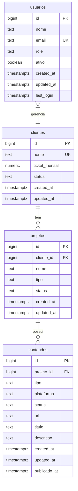

# ERD - Entity Relationship Diagram

**Projeto:** Citara Marketing IA
**Database:** Supabase PostgreSQL
**Versão:** 1.0
**Data:** 2026-02-22

---

## Diagrama Entidade-Relacionamento



---

## Legenda

| Símbolo | Descrição |
|---------|-----------|
| `||--o{` | Um para muitos (opcional) |
| `}|--||` | Um para um |
| `PK` | Primary Key (Chave Primária) |
| `FK` | Foreign Key (Chave Estrangeira) |
| `UK` | Unique Key (Chave Única) |

---

## Detalhes das Entidades

### 1. clientes

**Descrição:** Clientes da agência de marketing

| Coluna | Tipo | Restrições | Descrição |
|--------|------|------------|-----------|
| id | BIGSERIAL | PK | Identificador único |
| nome | TEXT | NOT NULL, UK | Nome do cliente |
| ticket_mensal | DECIMAL(10,2) | - | Valor mensal do contrato (BRL) |
| status | TEXT | DEFAULT 'ativo' | ativo, inativo, pausado |
| created_at | TIMESTAMPTZ | DEFAULT NOW() | Data de criação |
| updated_at | TIMESTAMPTZ | DEFAULT NOW() | Data de atualização |

**Constraints:**
- CHECK (status IN ('ativo', 'inativo', 'pausado'))
- UNIQUE (nome)

**RLS Policies:**
- `clientes_select_authenticated`: authenticated pode ler
- `clientes_all_admin`: admin pode tudo

---

### 2. projetos

**Descrição:** Projetos de marketing por cliente

| Coluna | Tipo | Restrições | Descrição |
|--------|------|------------|-----------|
| id | BIGSERIAL | PK | Identificador único |
| cliente_id | BIGINT | FK, NOT NULL | Referência a clientes |
| nome | TEXT | NOT NULL | Nome do projeto |
| tipo | TEXT | - | Tipo (social_media, trafego_pago, etc.) |
| status | TEXT | DEFAULT 'pendente' | pendente, em_andamento, concluido |
| created_at | TIMESTAMPTZ | DEFAULT NOW() | Data de criação |
| updated_at | TIMESTAMPTZ | DEFAULT NOW() | Data de atualização |

**Constraints:**
- FK → clientes(id) ON DELETE CASCADE
- CHECK (status IN ('pendente', 'em_andamento', 'concluido', 'cancelado'))

**RLS Policies:**
- `projetos_select_authenticated`: authenticated pode ler
- `projetos_all_admin`: admin pode tudo

---

### 3. conteudos

**Descrição:** Conteúdos de marketing (posts, artes, vídeos)

| Coluna | Tipo | Restrições | Descrição |
|--------|------|------------|-----------|
| id | BIGSERIAL | PK | Identificador único |
| projeto_id | BIGINT | FK, NOT NULL | Referência a projetos |
| tipo | TEXT | NOT NULL | post, historia, reel, arte, video |
| plataforma | TEXT | - | instagram, facebook, linkedin, tiktok |
| status | TEXT | DEFAULT 'rascunho' | rascunho, revisao, aprovado, publicado |
| url | TEXT | - | URL do conteúdo publicado |
| titulo | TEXT | - | Título do conteúdo |
| descricao | TEXT | - | Descrição ou legenda |
| created_at | TIMESTAMPTZ | DEFAULT NOW() | Data de criação |
| updated_at | TIMESTAMPTZ | DEFAULT NOW() | Data de atualização |
| publicado_at | TIMESTAMPTZ | - | Data de publicação |

**Constraints:**
- FK → projetos(id) ON DELETE CASCADE
- CHECK (status IN ('rascunho', 'revisao', 'aprovado', 'publicado'))

**RLS Policies:**
- `conteudos_select_authenticated`: authenticated pode ler
- `conteudos_all_admin`: admin pode tudo

---

### 4. usuarios

**Descrição:** Usuários do sistema

| Coluna | Tipo | Restrições | Descrição |
|--------|------|------------|-----------|
| id | BIGSERIAL | PK | Identificador único |
| nome | TEXT | NOT NULL | Nome completo |
| email | TEXT | NOT NULL, UK | Email único (login) |
| role | TEXT | DEFAULT 'usuario' | admin, usuario |
| ativo | BOOLEAN | DEFAULT true | Usuário ativo? |
| created_at | TIMESTAMPTZ | DEFAULT NOW() | Data de criação |
| updated_at | TIMESTAMPTZ | DEFAULT NOW() | Data de atualização |
| last_login | TIMESTAMPTZ | - | Último login |

**Constraints:**
- UNIQUE (email)
- CHECK (role IN ('admin', 'usuario'))

**RLS Policies:**
- `usuarios_select_self`: usuário vê apenas seus dados
- `usuarios_all_admin`: admin vê tudo

---

## Índices Criados

| Tabela | Índice | Colunas |
|--------|--------|--------|
| clientes | idx_clientes_status | status |
| projetos | idx_projetos_cliente_id | cliente_id |
| projetos | idx_projetos_status | status |
| conteudos | idx_conteudos_projeto_id | projeto_id |
| conteudos | idx_conteudos_status | status |
| conteudos | idx_conteudos_plataforma | plataforma |
| usuarios | idx_usuarios_email | email |
| usuarios | idx_usuarios_role | role |

---

## Relacionamentos

```
clientes 1:N projetos 1:N conteudos
   │
   └── usuarios N:1 gerencia
```

**Explicação:**
- Um cliente pode ter vários projetos
- Um projeto pode ter vários conteúdos
- Um usuário pode gerenciar vários clientes

---

## Triggers

| Trigger | Tabela | Função |
|---------|--------|--------|
| update_clientes_updated_at | clientes | Auto updated_at |
| update_projetos_updated_at | projetos | Auto updated_at |
| update_conteudos_updated_at | conteudos | Auto updated_at |
| update_usuarios_updated_at | usuarios | Auto updated_at |

---

*ERD v1.0 - Citara Marketing IA*
